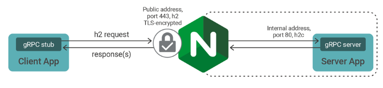

# Net Core gRPC proxy load balancing using Nginx

# This repository

This repository shows how to configure Nginx as reverse proxy server and load balancer for gRPC. 

## Getting started

1. Download repository 
2. Install Docker
3. Open command line
4. Execute commands described [here](./README_LoadBalance_Docker.md)

__NOTE: Assume that server app has multiple instances__

## Cleanup

Described [here](./README_LoadBalance_Docker.md)

## Sources

- https://www.nginx.com/blog/nginx-1-13-10-grpc/